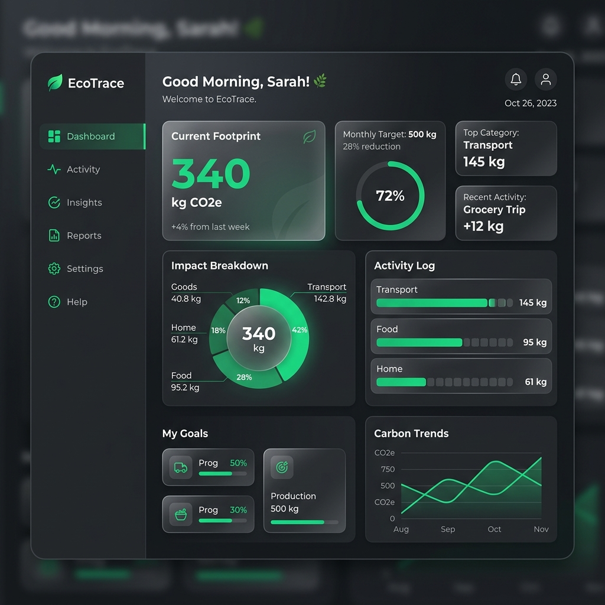

# EcoTrace – Carbon Footprint Reduction Assistant

An elegant, high-fidelity, accessible single-page web application (SPA) designed to help individuals calculate, analyze, track, and systematically reduce their monthly carbon footprint.

---

## 🌎 Problem Solved

Carbon dioxide and other greenhouse gas emissions drive global climate change, causing rising ocean temperatures, extreme weather events, and ecological disruptions. The average global footprint sits around 4 metric tons of CO2e per person annually, whereas the climate target to curb heating beneath 1.5°C requires individual emissions to drop below 2 metric tons.

**EcoTrace** resolves this by providing:
1. **Low-friction transparency**: Translating complex utility and transport bills into a single, standardized metric (kilograms of CO2e per month).
2. **Context-aware prioritization**: Custom ranking algorithms that ensure users see recommendations targeting their highest emissions source first.
3. **Behavioral tracking**: Goal scheduling and habit logs backed by milestone achievements to sustain user engagement and drive real-world reduction.

---

## 🛠️ Technology Stack

To ensure instant loading times, zero bundle overhead, and complete independence from node-related installation issues on host machines, EcoTrace leverages native modern web API technologies:

* **Core Structure**: HTML5 (Semantic landmarks & ARIA bindings)
* **Logic & Routing**: JavaScript ES Modules (using native `import`/`export` and state observers)
* **Styling & Theme**: Vanilla CSS3 (Custom design tokens, grid/flexbox layouts, theme overrides)
* **Data Visualization**: Custom SVG charts compiled dynamically via JavaScript
* **Database & Persistence**: Central Reactive Store with client-side JSON serialization in `localStorage`
* **Test Verification**: BDD Test Suite run directly in browser (`runner.html`) + CLI Verification (`run-tests.py` via Python 3)

---

## 📐 Project Structure

```
antigravity/
├── src/
│   ├── components/       # Reusable, self-contained UI components
│   │   ├── Card.js       # Base container card
│   │   ├── Chart.js      # Custom SVG gauges, pie breakdown, history graphs
│   │   ├── GoalItem.js   # Goal tracker card with custom progress actions
│   │   └── Modal.js      # Focus-trapped, keyboard-accessible dialog box
│   ├── pages/            # View managers for the SPA router
│   │   ├── Dashboard.js  # Main analytics dashboard & trend reports
│   │   ├── Calculator.js # Multi-step calculator with step validator bounds
│   │   ├── Recommendations.js # Prioritized suggestions & stagnation triggers
│   │   ├── Goals.js      # Goals management and unlocked milestones grid
│   │   └── Insights.js   # Educational science facts & levers comparison
│   ├── services/         # Core business logic
│   │   ├── Store.js      # Centralized state observer with localStorage sync
│   │   ├── CalculatorService.js # Emissions calculation logic
│   │   ├── RecommendationService.js # Prioritized ranking & stagnation engine
│   │   └── GoalService.js # Sustainability targets evaluator
│   ├── utils/            # Shared utilities
│   │   ├── dom.js        # Safe DOM node building & sanitization helpers
│   │   └── formatters.js # Human-readable carbon scale formatters (kg vs tons)
│   ├── models/           # Data templates and structures
│   │   └── Schema.js     # Footprint entry, goal, and achievement templates
│   ├── constants/        # Coefficient factors & boundaries
│   │   └── EmissionFactors.js # IPCC-based carbon multipliers
│   ├── validators/       # Boundary constraint checks
│   │   └── InputValidator.js # Validation rules
│   ├── tests/            # Test suites
│   │   ├── runner.html   # Visual, browser-based test suite report page
│   │   ├── test-framework.js # Custom BDD assert library
│   │   ├── unit-tests.js # Service and validator tests
│   │   ├── integration-tests.js # Achievements and goals evaluation checks
│   │   └── run-tests.py  # Python-based CLI test verifier
│   ├── app.js            # Main bootstrap entry point, theme and toast managers
│   └── index.css         # Styling system & dark/light theme definitions
├── public/               # Static assets
├── docs/                 # Project documentation
│   └── ecotrace_dashboard_mockup.png # Dashboard interface mockup
├── index.html            # Core SPA shell
├── README.md             # Developer documentation
├── .gitignore            # Git exclusion definitions
└── package.json          # Project metadata and running scripts
```

---

## 🎨 Screenshots Section

Below is a design mockup representing the EcoTrace Dashboard layout. It features our custom SVG comparison gauges, category breakdown donuts, historical charts, and key stats:



---

## 🚀 Installation & Running Locally

### Prerequisites
* Python 3.x (any modern version, for local server & CLI testing)

### 1. Cloning / Setup
Verify that all files are extracted to your target directory. Since the codebase uses native ES modules, running directly via `file://` protocol in the browser will trigger CORS restrictions. You must run it using a local HTTP server.

### 2. Running the Local Server
From the root of the project, start a simple Python-based HTTP server:
```bash
python -m http.server 8000
```
Then, open your browser and navigate to:
**[http://localhost:8000](http://localhost:8000)**

---

## 🧪 Testing

We support both an **Interactive in-browser test runner** and a **CLI verification suite**.

### 1. In-Browser Test Suite (Visual Report)
Open your browser and navigate to:
**[http://localhost:8000/src/tests/runner.html](http://localhost:8000/src/tests/runner.html)**
This page executes BDD suites checking calculators, priority logic, input bounds, and state updates, rendering a colorful dashboard.

### 2. Command Line Unit Testing
Run the Python test runner from the root folder:
```bash
python src/tests/run-tests.py
```

---

## 🔒 Security Considerations

* **Safe DOM Injection**: Custom HTML elements are created using `document.createElement`, with properties like `textContent` and `className` assigned explicitly. This completely mitigates XSS injection risks when parsing user inputs (e.g. customized goal descriptions).
* **Robust Form Validation**: In `InputValidator.js`, inputs are sanitized. Negative numbers, alpha inputs in numeric slots, and extreme boundary overflows (e.g. maxing electricity to 5000 kWh/month) are blocked at the validator level.
* **Corrupt Data Protections**: The local storage loader in `Store.js` verifies structural schemas. If local storage is corrupted, it catches the exception, logs a warning, and safely resets to base defaults rather than crashing the interface.

---

## ♿ Accessibility Features

EcoTrace targets WCAG 2.1 AA compliance guidelines:
* **Keyboard Navigation**: Native focus rings, structured focus styling, and explicit focus trapping loops inside modals. Users can navigate, fill forms, and trigger buttons entirely using Tab, Enter, Space, and Escape.
* **Skip Links**: A focusable skip-link (`Skip to main content`) is available at the top of the HTML hierarchy for screen reader and keyboard users.
* **Semantic Markups**: Using native layout structures (`<header>`, `<nav>`, `<main>`, `<section>`).
* **Contrast Compliance**: Contrast ratios for text colors meet or exceed 4.5:1 standards on both dark and light modes.
* **ARIA attributes**: Elements include roles (`role="dialog"`, `role="img"`, `role="tablist"`) and active state descriptions (`aria-live="assertive"`, `aria-describedby`, `aria-invalid`).

---

## 📝 Assumptions

1. **Grid Factors**: Grid electric carbon intensity varies dramatically by region. We assume a standard US/European grid average of `0.4 kg CO2e / kWh`.
2. **Flight Calculations**: Short flights (<3 hours) assume a multiplier of `150 kg CO2e` per trip, while long-haul flights (>3 hours) assume `500 kg CO2e` per trip. To ensure monthly metrics comparison is clean, yearly flight quantities are divided by 12.
3. **Local Storage Reliability**: `localStorage` is assumed to be stable and available. If incognito modes block access, state falls back to runtime memory, alerting the user to storage failures.

---

## 🔮 Future Improvements

* **API Integrations**: Linking directly to smart home electricity meters or transit API providers (e.g., Google Maps API) for automatic travel logs.
* **Dynamic Grid Intensities**: Hooking into third-party grid trackers (like Electricity Maps API) to adjust carbon factors by regional zip code.
* **Social Gamification**: Enabling shared community boards to encourage reduction competitions between friends.
